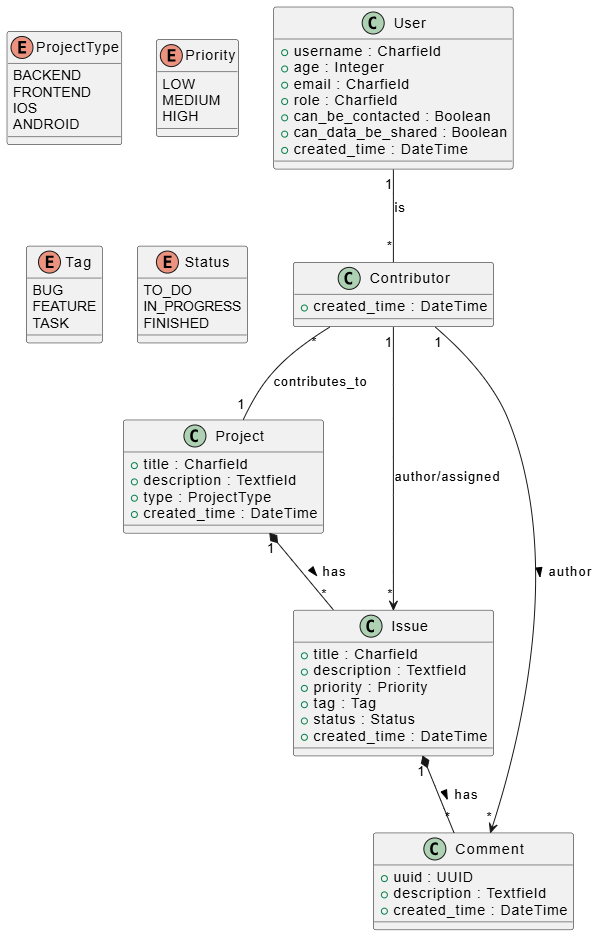

# SoftDesk API

API REST développée avec Django REST Framework pour la gestion de projets et de tickets de support.

## Table des matières

- [SoftDesk API](#softdesk-api)
  - [Table des matières](#table-des-matières)
  - [Installation](#installation)
    - [Prérequis](#prérequis)
    - [Étapes d'installation](#étapes-dinstallation)
  - [Lancement du projet](#lancement-du-projet)
  - [Diagramme de classes UML](#diagramme-de-classes-uml)
  - [Auteur](#auteur)
  - [Licence](#licence)

## Installation

### Prérequis

- Python 3.8 ou supérieur
- pip (gestionnaire de paquets Python)

### Étapes d'installation

1. **Cloner le dépôt**

   ```bash
   git clone https://github.com/MithrandirEa/P10_SoftDesk_API.git
   cd SoftDesk-API
   ```

2. **Créer un environnement virtuel**

   Sous Windows :
   ```powershell
   python -m venv .venv
   .venv\Scripts\Activate.ps1
   ```

   Sous macOS/Linux :
   ```bash
   python3 -m venv .venv
   source .venv/bin/activate
   ```

3. **Installer les dépendances**

   ```bash
   pip install -r requirements.txt
   ```

4. **Appliquer les migrations**

   ```bash
   cd src
   python manage.py migrate
   ```

5. **Créer un superutilisateur (optionnel)**

   ```bash
   python manage.py createsuperuser
   ```

## Lancement du projet

1. **Activer l'environnement virtuel** (si ce n'est pas déjà fait)

   Sous Windows :
   ```powershell
   .venv\Scripts\Activate.ps1
   ```

   Sous macOS/Linux :
   ```bash
   source .venv/bin/activate
   ```

2. **Démarrer le serveur de développement**

   ```bash
   cd src
   python manage.py runserver
   ```

3. **Accéder à l'API**

   L'API sera accessible à l'adresse : `http://127.0.0.1:8000/`
   
   L'interface d'administration Django : `http://127.0.0.1:8000/admin/`

## Diagramme de classes UML

Le diagramme de classes UML du projet est disponible dans le fichier [SoftDesk-Classes.puml](SoftDesk-Classes.puml).



## Auteur

**SCIPION Clément**  
Email : [clscipion@gmail.com](mailto:clscipion@gmail.com)

Ce projet a été réalisé dans le cadre de la formation de Développeur d'Application Python d'OpenClassrooms.

## Licence

Ce projet est sous licence MIT.